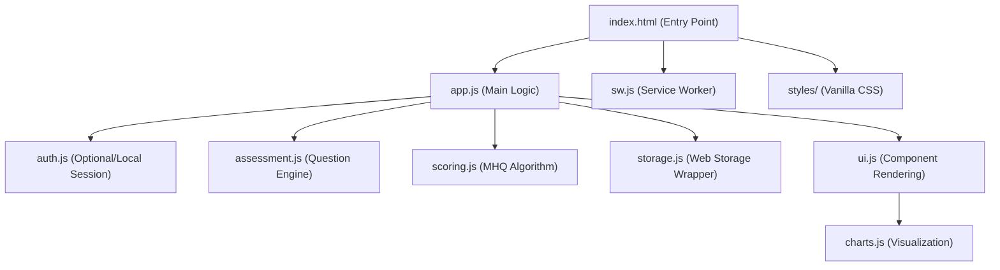

# Software Design Document (SDD) - MHQ Analysis PWA

## 1. System Architecture

### 1.1 Overview
The MHQ Analysis PWA is a 100% client-side application using a "no-build" architecture. It relies on native browser features for modularity, styling, and offline capabilities.

### 1.2 Component Diagram (ESM Modules)
The application is structured into functional modules using JavaScript ES Modules:



---

## 2. Module Design

### 2.1 Assessment Engine (`assessment.js`)
- **Responsibility**: Manages the flow of 47 assessment items.
- **State**: Tracks current question index and captured responses.
- **Features**: 
    - Question dynamic rendering.
    - Input validation.
    - Navigation (Back/Next).

### 2.2 Scoring Engine (`scoring.js`)
- **Responsibility**: Implements the MHQ nonlinear algorithm.
- **Logic**:
    1.  **Map**: Convert 1-9 radio inputs to -4 to +4 internal values.
    2.  **Weight**: Apply nonlinear penalties to negative scores based on Sapien Labs methodology.
    3.  **Aggregate**: Calculate 6 dimension sub-scores and 1 global MHQ score.
    4.  **Normalize**: Scale final results to the -100 to 200 range.

### 2.3 Storage Module (`storage.js`)
- **Responsibility**: Abstracting browser storage.
- **Backend**: `LocalStorage` for user preferences/settings; `IndexedDB` for historical assessment data.
- **Schema**:
    ```json
    {
      "assessments": [
        {
          "timestamp": "2026-03-08T12:00:00Z",
          "raw_responses": [1, 5, 9, ...],
          "scores": { "overall": 140, "mood": 45, ... }
        }
      ]
    }
    ```

---

## 3. UI/UX Design

### 3.1 Design System
- **Layout**: Mobile-first, centered card layout for assessments.
- **Theming**: 
    - CSS Variables for easy maintenance (`--primary-color`, `--bg-glass`).
    - Dark/Light mode support via `prefers-color-scheme`.
- **Aesthetics**:
    - **Glassmorphism**: `backdrop-filter: blur(10px)` for modal and cards.
    - **Typography**: Inter (System Font Stack fallback).

### 3.2 Key Views
1.  **Home**: Overview of past scores and "Start Assessment" button.
2.  **Assessment**: Single-question-at-a-time interface with progress bar.
3.  **Result Dashboard**: Radar chart showing the 6 dimensions and the primary MHQ score.

---

## 4. PWA and Offline Strategy

### 4.1 Service Worker (`sw.js`)
- **Strategy**: Cache-First for static assets (JS, CSS, Icons).
- **Versioning**: Incremental version numbers in the cache name for cache busting.
- **Events**:
    - `install`: Pre-caches core files.
    - `activate`: Cleans up old caches.
    - `fetch`: Serves assets from cache, falling back to network.

### 4.2 Web App Manifest (`manifest.json`)
- **Display**: `standalone` (removes browser chrome).
- **Orientation**: `portrait-primary`.
- **Theme Color**: Aligned with the application's primary palette.

---

## 5. Security and Privacy

### 5.1 Local-Only Architecture
- **No API calls**: The application never performs `fetch` or `XMLHttpRequest` to external assessment servers.
- **Data Export**: Option for users to download their local data as a JSON file.
- **Data Erasure**: Functional "Factory Reset" to clear all `LocalStorage` and `IndexedDB` entries.
